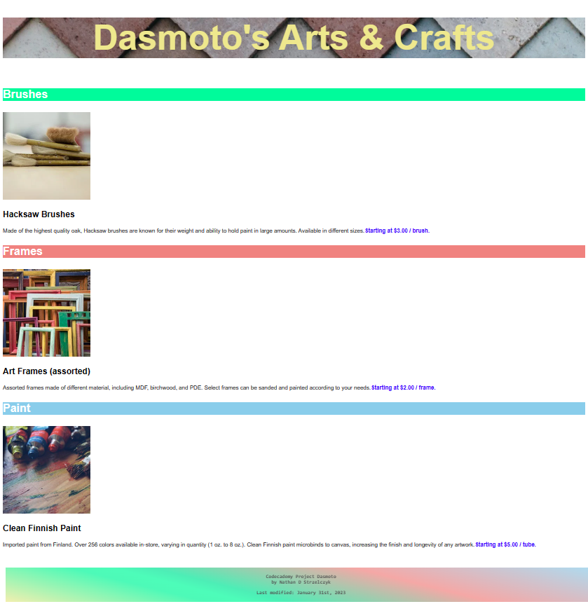

###### codecademy-project-dasmoto

<h1 align="center"><a href="https://www.codecademy.com/paths/learn-how-to-build-websites/tracks/build-websites-on-your-own-computer/modules/local-website-development/projects/dasmoto">Codecademy Project Dasmoto</h1></a>

Completed with last year's skills. Updated with some from this year.

- Added Features:
   - A truly colorful footer.
   - A last-modified date display on the footer courtesy of some JavaScript.

  
   
  Picture: My Completed Codecademy Project Dasmoto

